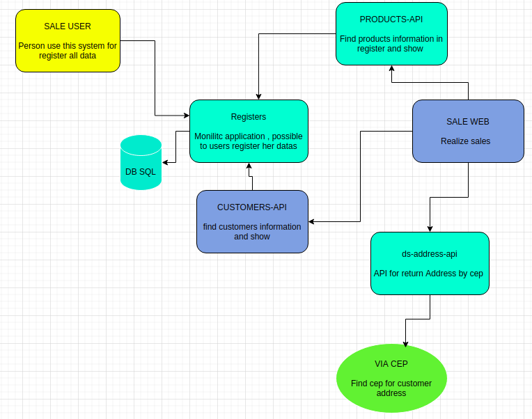
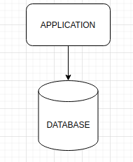
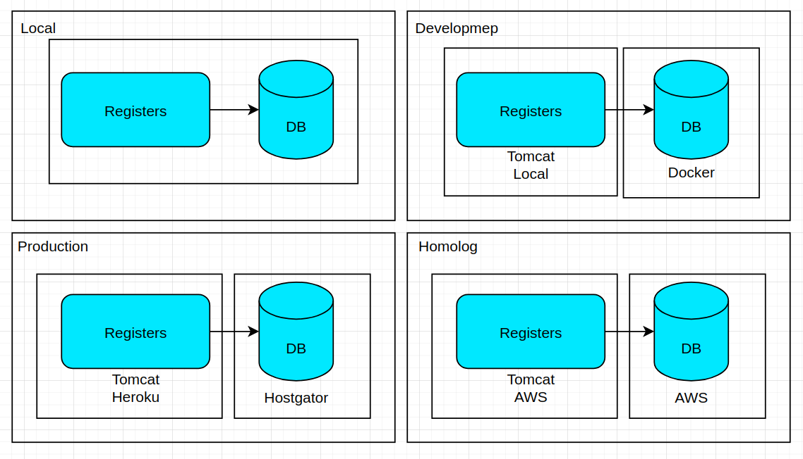

Monolitic Java 14 application
for simulate a litle store.

this projecs is only a monolitic system to registers and mantain all data 

# Tecnologies
<ul>
    <li>Spring / Spring Boot/Spring Security</li>
    <li>Java14, Maven</li>
    <li>Monolitic application</li>
    <li>Thymeleaf</li>
    <li>MySQL Database / H2DB</li>
    <li>Bycrpt </li>
    <li>Docker / Clouds </li>
</ul>

# Project Architecture 

# Monolithic Architecture

# Enviroments 

# LOCAL ENVIROMENT 

1. `./mvmw clean install`
2. `java -jar -Dspring.profiles.active=local target/registrations-0.0.1-SNAPSHOT.jar`

# DEV ENVIROMENT 

1. Install Java14
2. Up docker compose image in devops foulder.
`docker-compose up --build`
3. go to mysql db and create database 
4. go to mysql db and execute data.sql for insert all data  
5. `./mvmw clean install`
6. `java -jar -Dspring.profiles.active=development target/registrations-0.0.1-SNAPSHOT.jar`

# HOMOLOG ENVIROMENT 

1. `./mvmw clean install`
2. `java -jar -Dspring.profiles.active=homolog target/registrations-0.0.1-SNAPSHOT.jar`

# PRODUCTION ENVIROMENT Heroku 

1. App Heroku
2. App on Hostgator 

https://dsmanioto-registera.herokuapp.com/

# PRODUCTION ENVIROMENT AWS 

`java -jar -Dspring.profiles.active=production target/registrations-0.0.1-SNAPSHOT.jar`

1. App AWS
2. App on Hostgator 

http://ec2-3-22-186-245.us-east-2.compute.amazonaws.com:8080/

# Using

1. Home and first test
http://localhost:8080/home

user: daniel
password: 123 

2. Product 

http://localhost:8080/products/signup
http://localhost:8080/products/list

# CI & CD

1. https://travis-ci.com/

# SCM

<ul>
  <li>Use gitflow https://www.atlassian.com/git/tutorials/comparing-workflows/gitflow-workflow</li>
  <li>master:</li>
  <li>develop:</li>
  <li>feature:</li>
  <li>release:</li>
  <li>bugfix:</li>
</ul>

# References

1. https://spring.io/guides/gs/accessing-data-mysql/
2. https://www.appsdeveloperblog.com/spring-security-default-username-password-
3. role/#:~:text=Add%20Spring%20Security&text=The%20default%20username%20is%3A%20user,Spring%20Boot%20project%20is%20starting.
4. https://www.javaguides.net/2019/04/spring-boot-thymeleaf-crud-example-tutorial.html
5. https://github.com/RameshMF/springboot-thymeleaf-crud-tutorial
